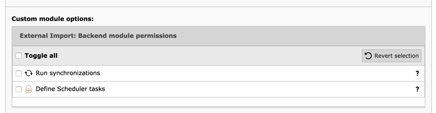

.. include:: /Includes.rst.txt

.. _administration-user-rights:

User rights
^^^^^^^^^^^

Before digging into the TCA specifics let's have a look at the topic
of user rights. Since External Import relies on :php:`\TYPO3\CMS\Core\DataHandling\DataHandler`
for storing data, the user rights on the synchronized tables will always be
enforced. However additional checks are performed in both the BE
module and the automated tasks to avoid displaying sensitive data or
throwing needless error messages.

When accessing the BE module, user rights are taken into account in
that:

- a user must have at least listing rights on a table to see it in the
  BE module.

- a user must have modify rights on a table to be allowed to synchronize
  it manually or define an automated synchronization for it.

Furthermore explicit permissions must be set in the BE user group for
allowing a user to run synchronizations from the BE module and to define
Scheduler tasks. This is found at the bottom of the "Access Lists" tab.

    Setting specific permissions for the BE module

DB mount points are not checked at this point, so the user may be
able to start a synchronization and still get error messages if not
allowed to write to the page where the imported data should be stored.

An automated synchronization will be run by the Scheduler. This
means that the active user will be :code:`_cli_`, who is an admin user.
Thus no special setup is needed. The same is true for :ref:`command-line calls <user-command>`.
