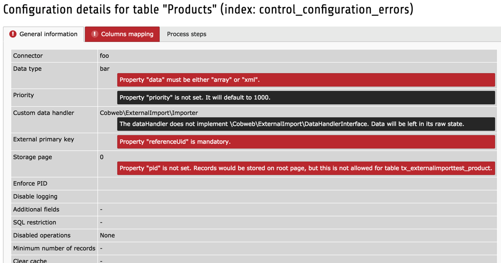
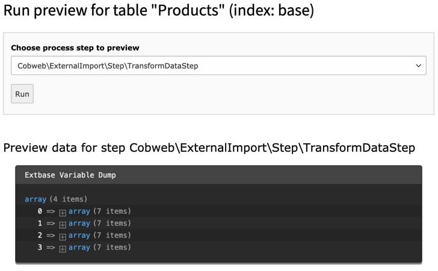

.. include:: ../../Includes.txt

.. _user-backend-module:

Using the backend modules
^^^^^^^^^^^^^^^^^^^^^^^^^

The extension provides two backend modules. The "Data Import" is the main one,
displaying all configurations and allowing to start imports manually. The
second one, "Log", displays a list of all log entries generated during
External Import runs.

.. _user-backend-module-synchronizable:

Synchronizable tables
"""""""""""""""""""""

The first function of the "Data Import" BE module – called "Tables with
synchronization" – displays a list of all synchronizable tables. The
various features are summarized in the picture below.

.. figure:: ../../Images/SynchronizableTablesOverview.png
	:alt: BE module overview for synchronizable tables

	Overview of the synchronizable tables view with all available
	functions

.. note::

   Icons may vary depending on user rights. Users without the proper rights
   or without write access to a given table will not see the synchronize and preview buttons,
   nor the actions related to the Scheduler.

.. _user-backend-module-synchronizable-details:

Viewing configuration details
~~~~~~~~~~~~~~~~~~~~~~~~~~~~~

Clicking on the information icon leads to a screen showing
all the information about that particular configuration. The view
consists of three tabs: the first one displays the :ref:`general configuration <administration-general-tca>`,
the second one displays the :ref:`configuration for each column <administration-columns>`
and the third one displays the list of :ref:`steps that the process will go through <user-overview>`,
including any :ref:`custom steps <developer-steps>`.

.. figure:: ../../Images/InformationInspector.png
	:alt: Inspecting TCA properties

	Viewing the details of the TCA properties for External Import

If the configuration contains errors, they will be displayed in this
detailed view.

	Viewing errors in the External Import configuration

.. note::

   The configuration validator also runs right before an import.
   The import will abort if any critical error is found in the
   configuration. Notices do not block the import process.

.. _user-backend-module-synchronizable-sync:

Triggering a synchronization
~~~~~~~~~~~~~~~~~~~~~~~~~~~~

Clicking on the synchronize data button will immediately start
the synchronization of the corresponding table. This may take quite
some time if the data to import is large. If you move away from the BE
module during that time, the process will abort. At the end of
the process, flash messages will appear with the results:

.. figure:: ../../Images/SynchronizationResults.png
	:alt: Results of synchronization

	Flash messages show the results of the synchronization

.. _user-backend-module-synchronizable-preview:

Running in preview mode
~~~~~~~~~~~~~~~~~~~~~~~

Clicking on the preview button leads to the preview feature.
For running a preview your first need to select a specific
:ref:`step from the process <user-overview>`. The synchronization
will run up to that step and stop. Preview data gets displayed
if available (this depends on the step).

Most importantly nothing permanent happens in preview mode.
For example, data is not stored into the database.

	The synchronization is run up to the Transform Data step and preview data is dumped to the screen

.. _user-backend-module-automation:

Setting up the automatic schedule
"""""""""""""""""""""""""""""""""

The automatic scheduling facility relies on the Scheduler to run. On
top of the normal Scheduler setup, there are some points you must pay
particular attention to in the case of external import.

As can be seen in the above screenshot, the information whether the
automatic synchronization is enabled or not is displayed for each
table. It is possible to add or change that schedule, by clicking on
the respective icons. This leads to an input form where you can choose
a frequency, a task group and a start date (date of first execution;
leave empty for immediate activation). The frequency can be entered
as a number of seconds or using the same syntax as for cron jobs.

.. note::

   If a Scheduler task exists but has been disabled, it cannot be enabled
   again from the External Import backend module. It is considered that an
   administrator had a good reason to disable that task and it is up to that
   person to enable it again.

.. figure:: ../../Images/AutomationDialog.png
	:alt: Automation input form

	Input form for setting automated synchronization parameters

Clicking on the trash can icon cancels the automatic
synchronization (a confirmation window will appear first).

At the top of the screen, before the list, it is possible to define a
schedule for **all** tables. This means that all imports will be
executed one after the other, in the order of priority.

.. figure:: ../../Images/FullAutomation.png
	:alt: Automating all tables

	Setting automated synchronization for all tables

The same input form appears as for individual automation settings.

.. note::

   Of course, it is perfectly possible to define automation tasks
   from within the Scheduler's BE module. External Import offers this
   as a convenience and also for non-admin users.

.. _user-backend-module-non-synchronizable:

Non-synchronizable tables
"""""""""""""""""""""""""

The second function of the "Data Import" BE module – called "Tables without
synchronization" – displays a list of non-synchronizable tables. This
view is purely informative as no action can be taken for these tables.
Only the detailed configuration information can be accessed.

.. figure:: ../../Images/NonSynchronizableTablesOverview.png
	:alt: BE module overview for non-synchronizable tables

	Overview for non-synchronizable tables, with just the information icon

.. _user-backend-module-logs:

Logs
""""

As its name implies, the "Log" module displays a list of all log entries
generated during External Import runs. The list is sortable and searchable.
Each entry has a context, which gives an idea on how the run took place,
either triggered manually (via the backend module), run via the Scheduler
or the command line, or called using the API. Any other status will appear
as "Other".

There is also a duration associated with each log entry. This is actually the
duration of the whole import run and will be the same for all log entries related
to the same run.

There is not much more to it for now. It may gain new features in the future.

.. figure:: ../../Images/LogModule.png
	:alt: BE module overview for non-synchronizable tables

	List of import log entries

.. note::

   Runs made in preview mode are not logged.
