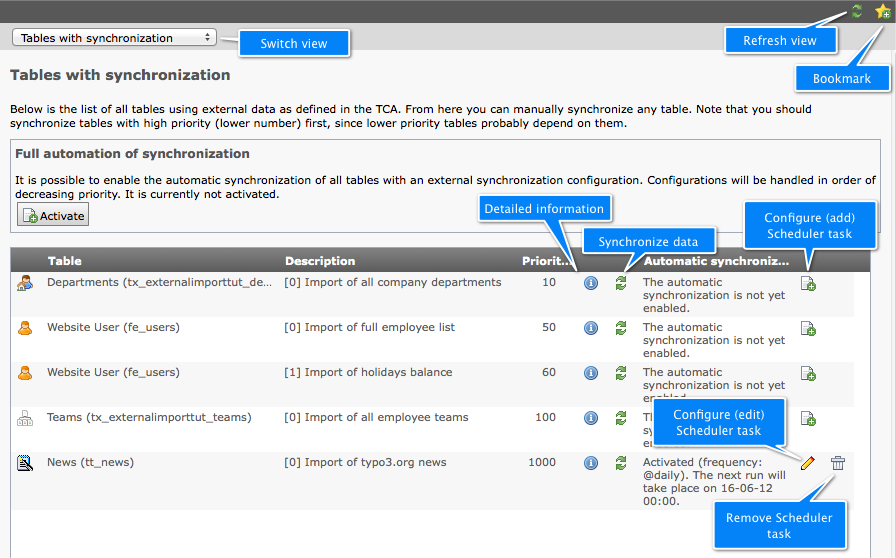
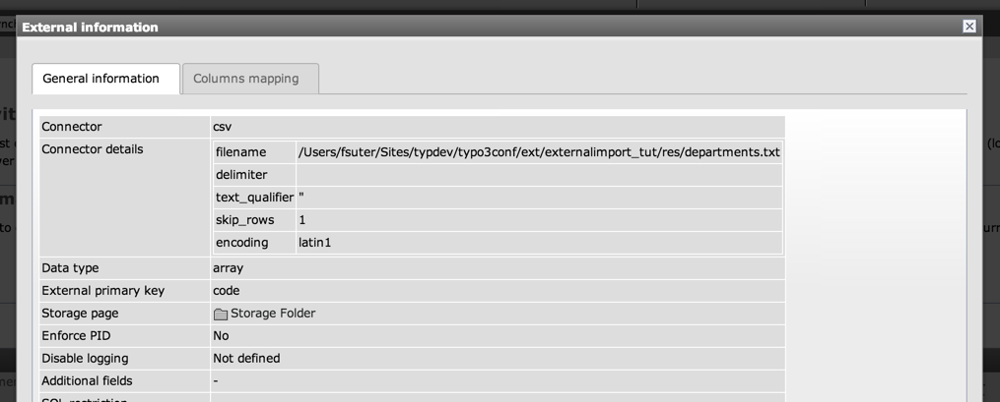
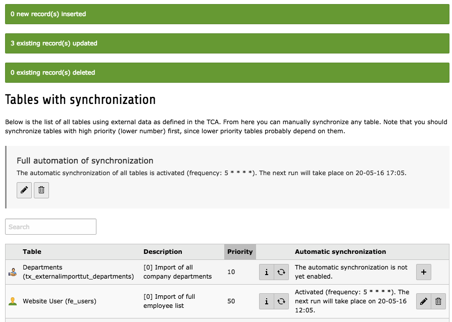
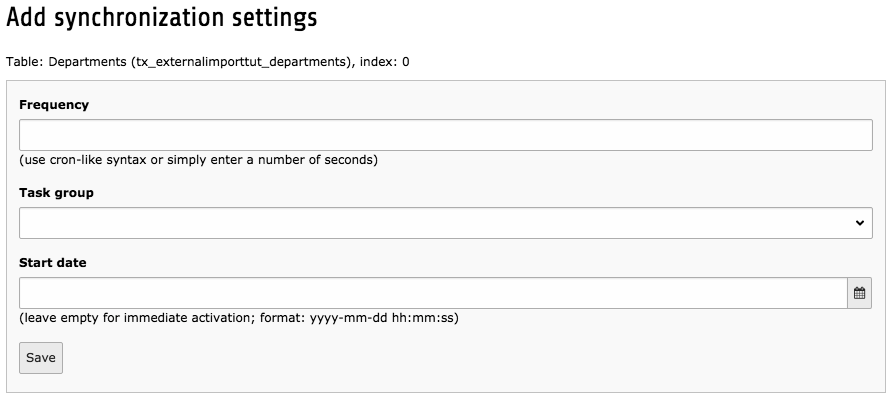
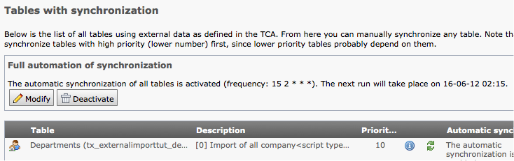
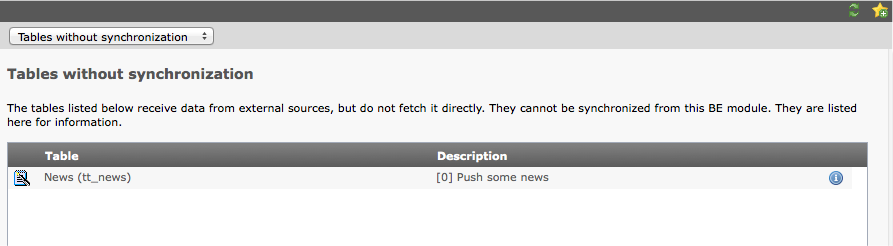

.. ==================================================
.. FOR YOUR INFORMATION
.. --------------------------------------------------
.. -*- coding: utf-8 -*- with BOM.

.. include:: ../../Includes.txt

.. _user-backend-module:

Using the backend module
^^^^^^^^^^^^^^^^^^^^^^^^

.. _user-backend-module-synchronizable:

Synchronizable tables
"""""""""""""""""""""

The first function of the BE module – called "Tables with
synchronization" – displays a list of all synchronizable tables. The
various features are summarized in the picture below.

	Overview of the synchronizable tables view with all available
	functions

.. note::

   Icons may vary depending on user rights.
   For users without write access to a given table the synchronize button
   will be disabled. They will also not see any of the actions related to the Scheduler.

Clicking on the information icon leads to a screen showing
all the information about that particular configuration. The view
consists of two tabs: the first one displays the configuration from
the "ctrl" section of the TCA ("General information"), the second one
displays the configuration for each column ("Columns mapping").

	Viewing the details of the TCA properties for external import

Clicking on the synchronize data button will immediately start
the synchronization of the corresponding table. This may take quite
some time if the data to import is large. If you move away from the BE
module during that time, the process will abort. At the end of
the process, flash messages will appear with the results:

	Flash messages show the results of the synchronization

.. _user-backend-module-automation:

Setting up the automatic schedule
"""""""""""""""""""""""""""""""""

The automatic scheduling facility relies on the Scheduler to run. On
top of the normal Scheduler setup, there are some points you must pay
particular attention to in the case of external import.

As can be seen in the above screenshot, the information whether the
automatic synchronization is enabled or not is displayed for each
table. It is possible to add or change that schedule, by clicking on
the respective icons. This leads to an input form where you can choose
a frequency, a task group and a start date (date of first execution;
leave empty for immediate activation). The frequency can be entered
as a number of seconds or using the same syntax as for cron jobs.

	Input form for setting automated synchronization parameters

Clicking on the trash can icon cancels the automatic
synchronization (a confirmation window will appear first).

At the top of the screen, before the list, it is possible to define a
schedule for **all** tables. This means that all imports will be
executed one after the other, in the order of priority.

	Setting automated synchronization for all tables

The same input form appears as for individual automation settings.

Defining a schedule is not enough. Proper user rights must also be
considered. See the :ref:`User rights section <administration-user-rights>`
in the "Administration" chapter.

.. note::

   Of course, it is perfectly possible to define automation tasks
   from within the Scheduler's BE module. External Import offers this
   as a convenience and also for non-admin users.

.. _user-backend-module-non-synchronizable:

Non-synchronizable tables
"""""""""""""""""""""""""

The second function of the BE module – called "Tables without
synchronization" – displays a list of non-synchronizable tables. This
view is purely informative as no action can be taken for these tables.
Only the detailed configuration information can be accessed.

	Overview for non-synchronizable tables, with just the information icon
