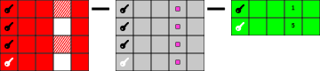
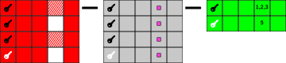
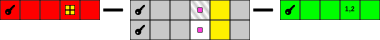
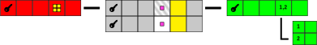

.. include:: ../../Includes.txt

.. _user-mapping-data:

Mapping data
^^^^^^^^^^^^

In the :ref:`Administration chapter <administration>`, you will find explanations about
how to map the data from the external source to existing or newly
created tables in the TYPO3 CMS database. There are two mandatory
conditions for this operation to succeed:

- the external data **must** have the equivalent of a primary key

- this primary key **must** be stored into some column of the TYPO3 CMS
  database, but **not** the uid column which is internal to TYPO3 CMS.

The primary key in the external data is the key that is used to
decide whether a given entry in the external data corresponds to a
record already stored in the TYPO3 CMS database or if a new record should
be created for that entry. Records in the TYPO3 CMS database that do not
match primary keys in the external data can be deleted if desired.

.. _user-mapping-data-import-scenarios:

Import scenarios
""""""""""""""""

External Import offers many options, some of which can be combined. This
can sometimes be confusing. This chapter attempts to explain some import
scenarios in order to show what is possible with External Import. It is
possible to create other scenarios than those shown below.

Above all else, the :ref:`preview mode <user-backend-module-synchronizable-preview>`
is your friend. Test and tune your configuration and check what data structure
results using the preview at any step in the process.

.. _user-mapping-data-import-scenarios-simplest:

The simplest scenario
~~~~~~~~~~~~~~~~~~~~~

The simplest scenario is when one row/line of external data corresponds to
one record in the TYPO3 database, possibly after some transformations. This is
what this image tries to convey:

One line of external data is read (red), it goes through some transformations (grey)
and finally gets saved to the TYPO3 database (green).

.. _user-mapping-data-import-scenarios-multiple-values:

Multiple values
~~~~~~~~~~~~~~~

One particular scenario is when one or more fields in the external data contains
multiple values, often comma-separated. What you probably want is to access each
individual value, apply transformations to it and then reconcatenate it. This is
what the :ref:`<administration-mapping-properties-multiplevaluesseparator>` property
does. It takes each value, tries to match it to an entry in the given database table
and concatenates again (with a comma), all the values that were mapped.
This is can be represented as:

.. figure:: ../../Images/ImportScenarios/MultipleValuesSeparatorScenario.svg
	:alt: Import scenario with multiple values separator

The external data (red) contains values that correspond to keys in the TYPO3 database.
The values are matched one by one (little magenta squares in the grey area) and
concatenated again for saving to the TYPO3 database (green).

.. _user-mapping-data-import-scenarios-denormalized-data:

Denormalized data
~~~~~~~~~~~~~~~~~

One common scenario - particularly with flat (CSV) data - is to received denormalized
data. This means that the data itself represents a many-to-many relation between two
sets of entities and that the total number of row/lines does not represent the actual
amount of entities but the amount of relationships between them. External Import
takes care not to import duplicate entries and automatically filters on the defined
external key (see property :ref:`referenceUid <administration-general-tca-properties-reference-uid>`).

However if you don't do any specific configuration, it is always the first row that
will be imported and the others will simply be discarded. This may not be what you
want. A schema for this situation could be:

The black key and the white key represent the external keys. Among the four rows,
there are only two different keys. And indeed, at the end of the process (green), only
two records are created in the TYPO3 database.

The column with the pattern represents the denormalized data. During the process (grey),
inside each row, this column may be mapped to some other database table (magenta squares),
but then only the first row is actually stored.

.. _user-mapping-data-import-scenarios-denormalized-data-multiple-rows:

Denormalized data with multiple rows
~~~~~~~~~~~~~~~~~~~~~~~~~~~~~~~~~~~~

The previous scenario may correspond to a real use case, but most likely not, because
it involves losing relationship information. To preserve it, one way is to use the
:ref:`multipleRows <administration-columns-properties-multiple-rows>` property.
It is defined at column-level and instructs External Import to not discard the excess
data, but to keep and merge it after all other transformations (it is assembled
as a comma-separated list of values).

The result can be represented as:

Only two records are created but the many-to-many relations are preserved.

.. note::

   This is absolutely independent of whether you are using a MM-table on the TYPO3
   side or not. If you are not, the comma-separated list will be stored as is. If you
   are, the TYPO3 Core Engine will take care of filling the MM-table for you.

.. _user-mapping-data-import-scenarios-substructure-fields-multiple-rows:

Substructure fields with multiple rows
~~~~~~~~~~~~~~~~~~~~~~~~~~~~~~~~~~~~~~

Another scenario is that the external data is not a flat structure, but contains
nested data. This is what the :ref:`substructureFields <administration-columns-properties-substructure-fields>`
property is for. It allows to fetch a value inside a deeper structure. But if there
are mutliple values, it will actually trigger an on-the-fly denormalization of
the external data, as the schema below attempts to portray:

The structured nested inside the external data (little yellow squares inside the
red bar) is extracted leading to two rows durign the process. The process may also
add columns. If the fields of the substructure are mapped to names of already defined
columns (from the column configuration or the additional fields), the values will
be put into those fields (and replace any existing value). If they are mapped to
differents names, however, this will create new columns. A mix and match is
possible.

In the schema above, the yellow column is new and the striped grey column represents
an existing column which was "overridden" with values from the substructure.

Note that extra columns do not have a full definition like the other columns and
thus don't go through the Transformation step (but are available in the rows for
manipulation inside user functions or custom steps). They are also not stored to the
database. If you map a substructure field to an existing column, it will both go
through the Transformation step and be saved to the database.

As for the extra rows they are collapsed back using comma-separated list of values
in the columns for which the :ref:`multipleRows <administration-columns-properties-multiple-rows>`
property was set.

.. _user-mapping-data-import-scenarios-substructure-fields-children:

Substructure fields with child records
~~~~~~~~~~~~~~~~~~~~~~~~~~~~~~~~~~~~~~

Starting from the same scenario as above, it is also possible to define child
records with the :ref:`children <administration-columns-properties-children>` property
instead of using :ref:`multipleRows <administration-columns-properties-multiple-rows>`.
In this case, the denormalized rows are not collapsed but each row is used to create
a separate child record:

Substructure fields may be used to fill children columns.

.. note::

   It is perfectly possible to create child records from "normal" denormalized
   data. Using substructure fields is just an example.
