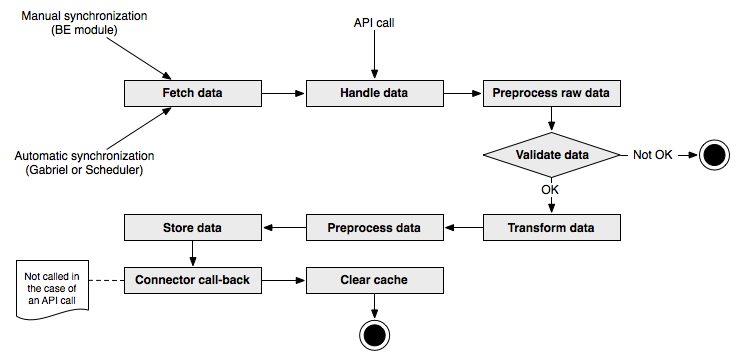

.. ==================================================
.. FOR YOUR INFORMATION
.. --------------------------------------------------
.. -*- coding: utf-8 -*- with BOM.

.. include:: ../../Includes.txt

.. _user-overview:

Process overview
^^^^^^^^^^^^^^^^

The schema below provides an overview of the external import process:

	The various steps of the external import process

When the external import is started from a synchronization
operation (pull), data is first gathered from the external source (if
some problem happens during this stage, the whole import process is
aborted). This does not happen when the API is used, since the data is
pushed into the import process. The next step is called "handle data".
This is where the data that will be stored into the internal tables is
filtered from all the data available from the external source. After
this step, the external data is available inside the process as an
associative PHP array with the keys matching the names of the database
fields where the data will be stored.

The preprocess raw data step is just a container to call a hook. The
next step validates the data. The base test is to check whether the
minimum number of records is present in the external data or not. A
hook is available for introducing more specific checks. The first
check to fail (including the base check) triggers the abortion of the
import process.

The transformation step is comprised of two important operations:

#. all simple (i.e. not MM) mappings are handled (or fixed values are
   applied).

#. declared user functions are called.

The preprocess step does nothing by itself, but provides a hook for
manipulating the complete recordset of imported data.

Finally the data is actually stored to the database. Before this
happens the MM-relationships are handled and hooks are available
before each type of operation happens (insert, update and delete).

As a last step the connector is called again in case one wishes to
perform some clean up operations on the source from which the data was
imported (for example, mark the source data as having been imported).
The :code:`postProcessOperations()` method of the connector API is called.
This will most probably just be a place for hooks as such post-
processing operations are likely to be rather custom steps. Note that
this step is not executed when the external import is started via an
API call, as there is no connector involved in such a case.

