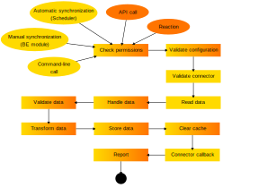

.. include:: ../../Includes.txt

.. _user-overview:

Process overview
^^^^^^^^^^^^^^^^

The schema below provides an overview of the external import process:

	The various steps of the external import process

The process is comprised of steps, each of which corresponds to a
PHP class (found in :code:`Classes/Step`). The steps are not the same
when synchronizing (pulling) data or when using the API or a reaction (pushing).
In the above schema, the steps with a gradient background belong to
both processes. The ones with a single color background are called
only by the corresponding process.

Each step may affect the raw data (the data provided by the external
source) and the so-called "records" (the data as it is transformed by
External Import along the various steps). A step can also set an
"abort" flag, which will interrupt the import process after the step
has completed. The following steps will not be executed unless specifically
designed to do so (this is indicated in the list below).

This chapter gives an overview of what each step does:

.. php:namespace:: Cobweb\ExternalImport\Step

.. php:class:: CheckPermissionsStep

   **Check permissions**

   This step checks whether the current user has the rights to modify
   the table into which data is being imported. If not, the process will
   abort.

.. php:namespace:: Cobweb\ExternalImport\Step

.. php:class:: ValidateConfigurationStep

   **Validate configuration**

   This step checks that the main configuration as well as each column
   configuration are valid. If any of them is not, the process will
   abort. The process will also abort if there is no general configuration
   or not a single column configuration.

.. php:namespace:: Cobweb\ExternalImport\Step

.. php:class:: ValidateConnectorStep

   **Validate connector**

   This steps checks if a Connector has been defined for the synchronize process.
   In a sense, it is also a validation of the configuration, but restricted
   to a property used only when pulling data.

   Up to that point, the :php:`\Cobweb\ExternalImport\Domain\Model\Data`
   object contains no data at all.

.. php:namespace:: Cobweb\ExternalImport\Step

.. php:class:: ReadDataStep

   **Read data**

   This step reads the data from the external source using the defined Connector.
   It stores the result as the "raw data" of the :php:`\Cobweb\ExternalImport\Domain\Model\Data`
   object.

.. php:namespace:: Cobweb\ExternalImport\Step

.. php:class:: HandleDataStep

   **Handle data**

   This step takes the raw data, which may be a XML structure or a PHP array,
   and makes it into an associative PHP array. The keys are the names of the
   columns being mapped and any additional fields declared with the
   :ref:`additionalFields property <administration-additionalfields>`.
   The values are those of the external data. The results are stored in the
   "records" of the :php:`\Cobweb\ExternalImport\Domain\Model\Data` object.

.. php:namespace:: Cobweb\ExternalImport\Step

.. php:class:: ValidateDataStep

   **Validate data**

   This steps checks that the external data passes whatever conditions have been
   defined. If this is not the case, the process is aborted.

.. php:namespace:: Cobweb\ExternalImport\Step

.. php:class:: TransformDataStep

   **Transform data**

   This step applies all the possible transformations to the external data,
   in particular mapping it to other database tables. The "records" in the
   :php:`\Cobweb\ExternalImport\Domain\Model\Data` object are updated with
   the transformed values.

.. php:namespace:: Cobweb\ExternalImport\Step

.. php:class:: StoreDataStep

   **Store data**

   This is where data is finally stored to the database. Some operations related to MM
   relations also happen during this step. The "records" in the
   :php:`\Cobweb\ExternalImport\Domain\Model\Data` object now contain the "uid"
   field.

.. php:namespace:: Cobweb\ExternalImport\Step

.. php:class:: ClearCacheStep

   **Clear cache**

   This step runs whatever cache clearing has been configured.

.. php:namespace:: Cobweb\ExternalImport\Step

.. php:class:: ConnectorCallbackStep

   **Connector callback**

   In this step the connector is called again in case one wishes to perform
   some clean up operations on the source from which the data was imported
   (for example, mark the source data as having been imported). The
   :code:`postProcessOperations()` method of the connector API is called.

   This step is called even if the process was aborted, so that error handling
   can happen with regards to the connector.

.. php:namespace:: Cobweb\ExternalImport\Step

.. php:class:: ReportStep

   **Report**

   This last step on the process performs reporting, essentially writing
   all log entries. It also triggers the :php:`\Cobweb\ExternalImport\Event\ReportEvent`,
   which itself triggers the :ref:`end of run webhook message <user-webhook>`.

   This step is called even if the process was aborted, so that error can be reported.

It is possible to add :ref:`custom Step classes <administration-general-tca-properties-customsteps>`
at any point in the process. On top of this several steps trigger
:ref:`events <developer-events>` which allow for further interactions with the default process.
