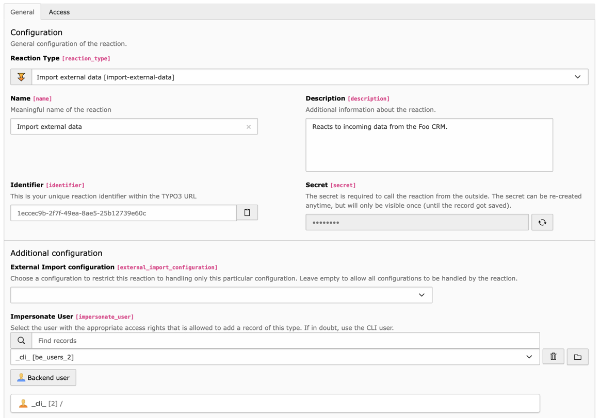
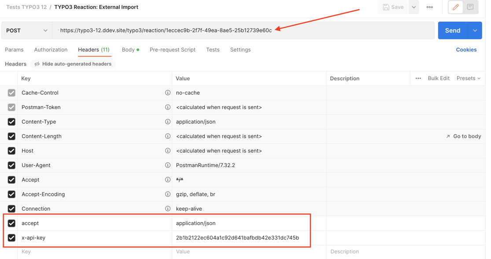
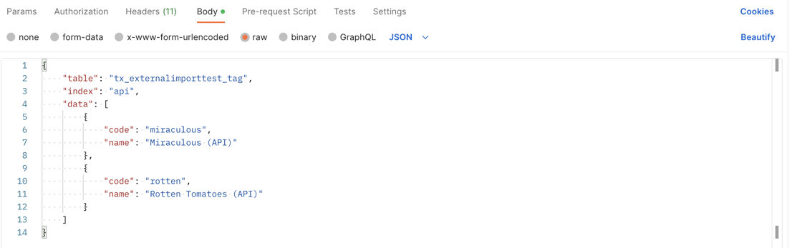

.. include:: /Includes.rst.txt

.. _user-reaction:

Reactions (External Import endpoints)
^^^^^^^^^^^^^^^^^^^^^^^^^^^^^^^^^^^^^

When using TYPO3 12, External Import provides reactions, i.e. endpoints
which can be called by any third-party software to push data to import or
to delete imported data.

Both reactions are defined in the same way. The expected payload is different,
and this is explained further down.

The "Import external data" reaction will import the data defined in the payload
as per the usual External Import process, inserting, updating and deteting records
by matching the incoming data set with the existing data set. However the import
reaction could also be used to import a single record (for example, if it used as
a webhook in a third-party application). In such a case, it is still easy
to insert or update, but the deleting of records cannot be automated anymore.
This is where the "Delete external data" reaction comes in. With it, one or more
records can be targeted for deletion, using their external primary key to identify
them.

.. _user-reaction-reaction:

Defining the reaction
"""""""""""""""""""""

A reaction must be defined using the "Reactions" module in the TYPO3 backend.
There can be more than one External Import reaction depending on your needs.
Having several reactions allows you to distribute secret keys to different people.

    Defining a reaction in the dedicated backend module

Choosing a configuration is optional. If one is chosen, the reaction will only
execute if the incoming configuration matches the selected configuration. This
provides better safety, but is more restrictive.

It is absolutely necessary to choose a BE user to impersonate, otherwise the data
will not be stored. The easiest option is to choose the :code:`_cli_` user but
this may seem too encompassing. You can use another BE user or define a specific
one, but make sure that it has the proper rights for writing to the table(s) targeted
by the import.

.. _user-reaction-configuration:

External Import configuration
"""""""""""""""""""""""""""""

The External Import configuration does not need anything special to be used by a
reaction. However if it is only ever used by reactions, then it does not need
connector information and can thus be a :ref:`Non-synchronizable table <user-backend-module-non-synchronizable>`.

.. note::

   When using the "Delete external data" reaction, matched data will be deleted even
   if the "delete" operation is disabled in the configuration
   (using :ref:`disabledOperations <administration-general-tca-properties-disabledoperations>`).
   It is assumed that you are meaning to delete anyway.

.. _user-reaction-payload:

Request payload
"""""""""""""""

To call the endpoint and trigger the External Import reaction, you need to call
the URI given by the reaction and pass it the secret key in the headers. The payload
in the request body is comprised of the following information:

table
  The name of the table targeted by the reaction (not necessary when a configuration is explicitly defined).

index
  The index of the targeted External Import configuration (not necessary when a configuration is explicitly defined).

data
  The data to handle.

  For the "Import external data" reaction, this can be either a JSON array (for
  :ref:`array-type data <administration-general-tca-properties-data>`) or
  a (XML) string for :ref:`XML-type data <administration-general-tca-properties-data>`).

  For the "Delete external data" reaction, it must be a JSON array, with the item(s) to delete.
  The key for identifying the external data must be in a field called "external_id". Example:

  .. code-block:: json

        {
            "table": "tx_externalimporttest_tag",
            "index": "api",
            "data": [
                {
                    "external_id": "miraculous"
                },
                {
                    "external_id": "rotten"
                }
            ]
        }

  If the incoming data cannot match this structure (but is still a JSON array),
  use the :ref:`GetExternalKeyEvent <developer-events-get-external-key>` event
  to extract the external key from the incoming data. If the incoming data does not
  match the above structure at all, you have to develop your own reaction.

pid (optional)
  If defined, this uid from the "pages" table will override the
  :ref:`pid property <administration-general-tca-properties-pid>` from
  the general configuration.

  This is not used by the "Delete external data" reaction.

Here is how it could look like (example made with Postman):

    The header with the URI, the accepted content type and the secret key

    The body of the payload with the table name, configuration index and data to import

.. _user-reaction-delete-reaction:

The delete reaction
"""""""""""""""""""

Since the "Delete external data" reaction is dedicated to deleting records, it is
quite different from the other bits of code in External Import. As far as reaction
payload is concerned, this has been discussed above.

About the configuration, it is important to understand that most of the configuration
is not used by the delete process. In fact the only properties that are used from the
:ref:`general configuration <administration-general-tca>` are:

- :ref:`referenceUid <administration-general-tca-properties-reference-uid>` to know
  in which field the external primary key is stored.
- :ref:`enforcePid <administration-general-tca-properties-enforcepid>`, which could be
  useful is a scenario where you would import the same records to different places in your
  TYPO3 installation, and thus have external primary keys which are unique only per pid.
- :ref:`whereClause <administration-general-tca-properties-where-clause>`
