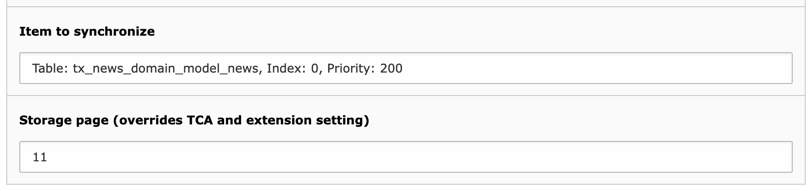

.. include:: ../../Includes.txt

.. _user-scheduler:

The Scheduler task
^^^^^^^^^^^^^^^^^^

The External Import process can be automated using the provided Scheduler task.
The automation can be defined from the :ref:`External Import backend module <user-backend-module>`
or directly from the Scheduler backend module.

The taks provides two specific options:

    The options of the External Import Scheduler task

Item to synchronize
  Choose which import configuration to automate. If you choose "all", all configurations will be synchronized
  in order of priority. The selector also provides a choice of all available groups and of each individual
  configuration.

Storage page
  This is the uid of a TYPO3 page. The imported data will be stored in that page, no matter what has been
  configured in the TCA or in the extension settings.
