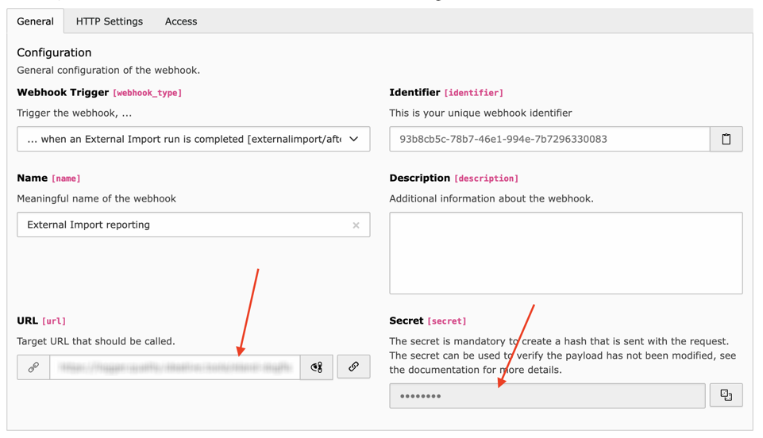

.. include:: /Includes.rst.txt

.. _user-webhook:

Webhook (outgoing message)
^^^^^^^^^^^^^^^^^^^^^^^^^^

When using TYPO3 12, External Import provides a webhook, i.e.
a message that can be sent to some third-party endpoint.

.. _user-webhook-webhook:

Defining the webhook
""""""""""""""""""""

A webhook must be defined using the "Webhooks" module in the TYPO3 backend,
choosing the "... when an External Import run is completed" trigger. You can
define several webhooks with the same trigger. Defining the webhook is
essentially about setting the target URL and generating the "secret" using
the field provided by TYPO3.

    Defining a webhook in the dedicated backend module

The message is sent right after an import has completed, in the :php:`ReportStep`
of the import process. The payload sent by External Import message contains
the following information:

- the name of the table
- the index of the import configuration
- the description of the import configuration
- all the messages reported by the process, in three categories (success, warnings and errors).
